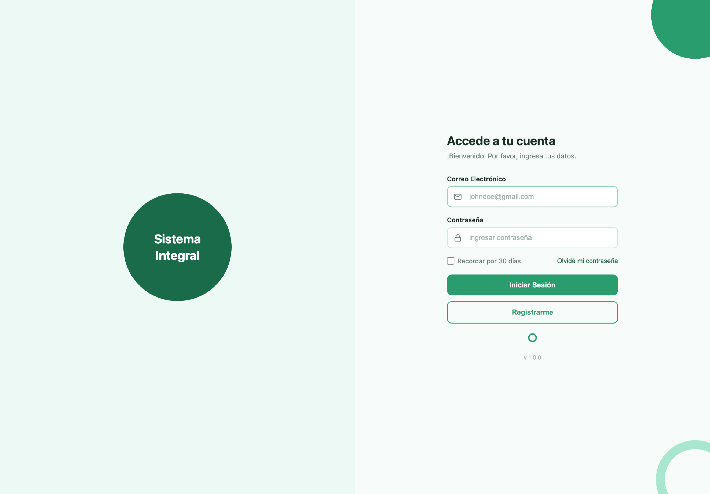
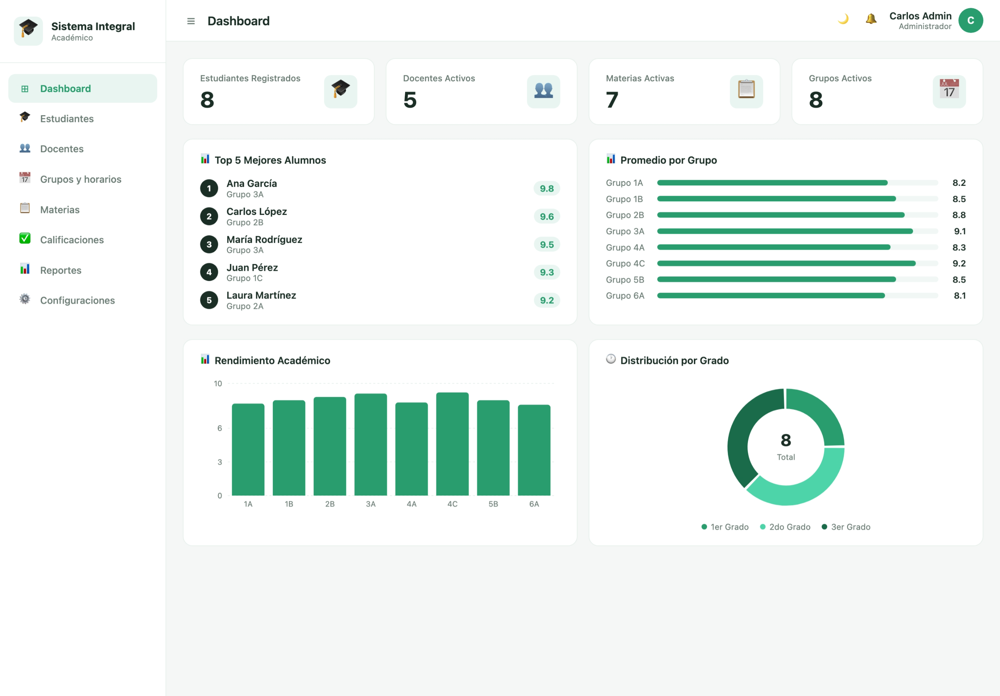
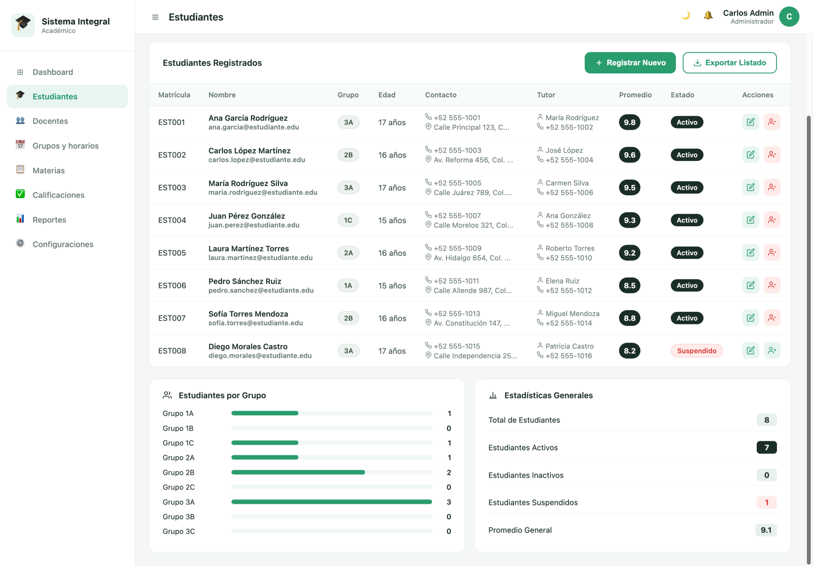
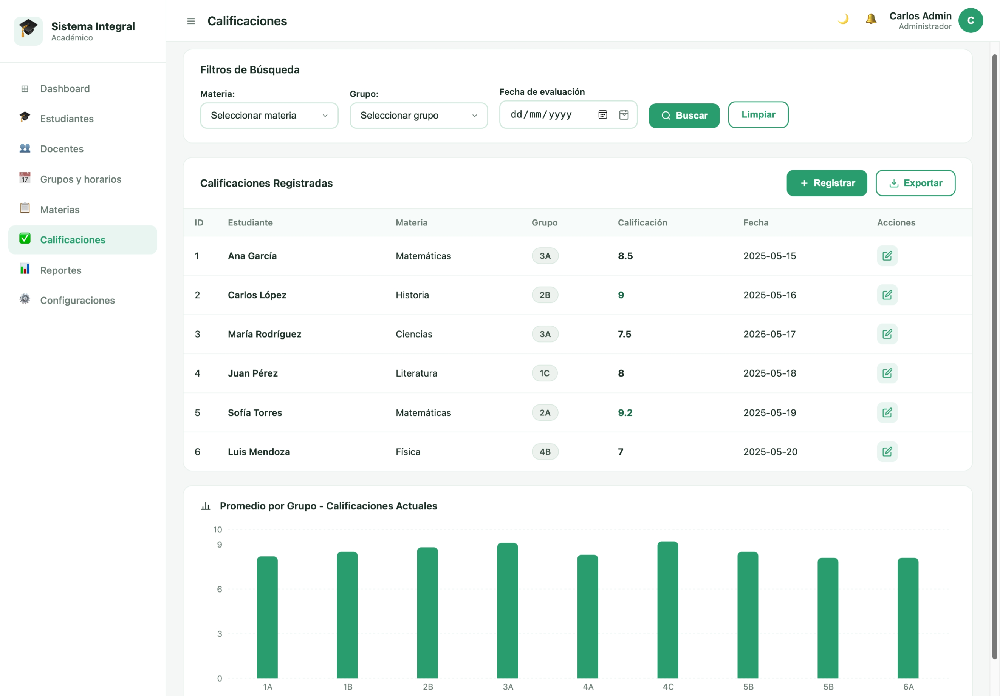

# Sistema Integral Académico
**Evidencia:** GA7-220501096-AA5-EV03

Sistema de gestión académica desarrollado con **React** (frontend) y **NestJS** (backend).
Incluye autenticación JWT, gestión de estudiantes, docentes, grupos, materias, calificaciones
y reportes, con soporte de modo claro/oscuro y sidebar colapsable.

> **Demo en vivo:** [https://andresroviram.github.io/GA7-220501096-AA5-EV03/](https://andresroviram.github.io/GA7-220501096-AA5-EV03/)

> **API Swagger:** [https://ga7-220501096-aa5-ev03-production.up.railway.app/api](https://ga7-220501096-aa5-ev03-production.up.railway.app/api)

---

## Capturas de pantalla

<table>
  <tr>
    <td></td>
    <td></td>
  </tr>
  <tr>
    <td></td>
    <td></td>
  </tr>
</table>

---

## Estructura del proyecto

```
├── backend/                        # API REST — NestJS + TypeORM + PostgreSQL
│   └── src/
│       ├── auth/                   # Autenticación (login, registro, JWT, logs)
│       ├── users/                  # Usuarios (entidad, servicio, DTOs)
│       ├── alumnos/                # Módulo de alumnos
│       ├── grupos/                 # Módulo de grupos
│       ├── horarios/               # Módulo de horarios y bloques
│       ├── materias/               # Módulo de materias
│       ├── calificaciones/         # Módulo de calificaciones
│       ├── seed/                   # Datos de demostración (auto-sembrado)
│       └── main.ts                 # Bootstrap (CORS, validación, Swagger)
├── frontend/                       # SPA — React 18 + Vite
│   └── src/
│       ├── components/             # LoginForm, RegisterForm, Topbar, Sidebar, ...
│       ├── layouts/                # MainLayout (sidebar + topbar)
│       ├── pages/                  # Dashboard, Estudiantes, Docentes, Grupos,
│       │                           # Materias, Calificaciones, Reportes, Configuraciones
│       ├── services/               # authService + servicios por módulo (Axios)
│       ├── data/                   # Mocks locales (fallback sin backend)
│       ├── hooks/                  # useTheme (modo claro/oscuro)
│       └── main.jsx
└── README.md
```

---

## Tecnologías utilizadas

| Capa          | Tecnología                                               |
|---------------|----------------------------------------------------------|
| Frontend      | React 18, Vite, React Router v7, Recharts, Axios         |
| Backend       | NestJS 10, TypeORM, Passport, JWT, bcrypt                |
| Base de datos | PostgreSQL (Railway en producción, local en desarrollo)  |
| Seguridad     | bcrypt (hash de contraseñas), JWT Bearer, class-validator|
| Docs API      | Swagger UI (`/api` del backend)                          |

---

## Requisitos previos

- Node.js v18 o superior
- npm v9 o superior

---

## Instalación y ejecución

### 1. Clonar el repositorio

```bash
git clone <url-del-repositorio>
cd "Diseño y Desarrollo de servicios web - caso GA7-220501096-AA5-EV01"
```

### 2. Backend (NestJS)

```bash
cd backend
npm install
npm run start:dev
```

El servidor arranca en **http://localhost:3000**
Swagger UI disponible en **http://localhost:3000/api**

Al iniciar por primera vez el **SeedService** crea automáticamente la base de datos
con datos de demostración (usuarios, alumnos, grupos, materias, calificaciones).

### 3. Frontend (React)

```bash
cd frontend
npm install
npm run dev
```

La aplicación estará disponible en **http://localhost:5173**

> El proxy de Vite redirige `/api/*` → `http://localhost:3000` automáticamente,
> por lo que no hay problemas de CORS en desarrollo.

---

## Variables de entorno

### Backend — `backend/.env`

```env
JWT_SECRET=tu_secreto_seguro_aqui
PORT=3000
```

### Frontend — `frontend/.env.development`

```env
# true  → autenticación local sin backend (MOCK_USERS)
# false → autenticación real contra NestJS en localhost:3000
VITE_USE_MOCK=false
```

Con `VITE_USE_MOCK=true` también se muestra la tarjeta de cuentas de prueba
en la pantalla de login, útil para demos sin servidor.

---

## Cuentas de demostración

Sembradas automáticamente por el SeedService al arrancar el backend por primera vez.

| Correo                          | Contraseña   | Rol              |
|---------------------------------|--------------|------------------|
| `admin@escuela.edu`             | `Admin123!`  | Administrativo   |
| `maria.garcia@escuela.edu`      | `Docente123!`| Docente          |
| `laura.martinez@escuela.edu`    | `Docente123!`| Docente          |
| `juan.rodriguez@escuela.edu`    | `Padre123!`  | Padre / Acudiente|

---

## Endpoints principales de la API

### Autenticación

| Método | Ruta             | Descripción                        |
|--------|------------------|------------------------------------|
| POST   | `/auth/login`    | Inicio de sesión — retorna JWT     |
| POST   | `/auth/register` | Registro de nuevo usuario          |

**Request login:**
```json
{
  "correo": "admin@escuela.edu",
  "password": "Admin123!"
}
```

**Response exitoso (200):**
```json
{
  "access_token": "eyJhbGciOiJIUzI1NiIsInR5cCI6IkpXVCJ9...",
  "correo": "admin@escuela.edu",
  "nombre": "Carlos Admin",
  "tipo_usuario": "administrativo"
}
```

**Response fallido (401):**
```json
{
  "statusCode": 401,
  "message": "Credenciales inválidas"
}
```

### Módulos protegidos (requieren `Authorization: Bearer <token>`)

| Módulo          | Prefijo           |
|-----------------|-------------------|
| Usuarios        | `/usuarios`       |
| Alumnos         | `/alumnos`        |
| Grupos          | `/grupos`         |
| Horarios        | `/horarios`       |
| Materias        | `/materias`       |
| Calificaciones  | `/calificaciones` |

Consultar la documentación completa en **http://localhost:3000/api**

---

## Flujo de autenticación

```
Usuario        Frontend (React)         Backend (NestJS)       Base de datos
  |                  |                        |                      |
  |--- correo/pass-->|                        |                      |
  |                  |-- POST /auth/login --->|                      |
  |                  |                        |-- findByCorreo() --->|
  |                  |                        |<-- user + hash ------|
  |                  |                        |-- bcrypt.compare()   |
  |                  |                        |-- log intento ------>|
  |                  |<---- JWT + perfil -----|                      |
  |<-- Dashboard ----|                        |                      |
```

---

## Funcionalidades del frontend

- **Login / Registro** con validación de formulario y manejo de errores
- **Dashboard** con estadísticas derivadas de los datos reales: total de estudiantes,
  docentes activos, materias activas, grupos; top 5 alumnos, promedios por grupo,
  rendimiento académico y distribución por grado
- **Gestión de módulos**: Estudiantes, Docentes, Grupos y Horarios, Materias,
  Calificaciones, Reportes, Configuraciones
- **Sidebar colapsable** — botón ☰ en la topbar colapsa a modo de solo iconos
- **Modo claro / oscuro** — toggle en la topbar, persiste en `localStorage`
- **Modo mock** — controlado por `VITE_USE_MOCK` en `.env.development`,
  permite desarrollar sin levantar el backend

---

## Seguridad implementada

- Contraseñas almacenadas con **bcrypt** (salt rounds = 10), nunca en texto plano
- Tokens **JWT** con expiración (configurada en `JWT_SECRET`)
- Validación de entradas con `class-validator` + `class-transformer` en los DTOs
- `ValidationPipe` global con `whitelist: true` y `forbidNonWhitelisted: true`
- **CORS** restringido al origen del frontend (`http://localhost:5173`)
- Mensajes de error genéricos en login (no revela si el correo existe)
- Log de intentos de autenticación (exitosos y fallidos) en tabla `autenticacion_log`

---

## Versionamiento

```bash
git log --oneline
```
